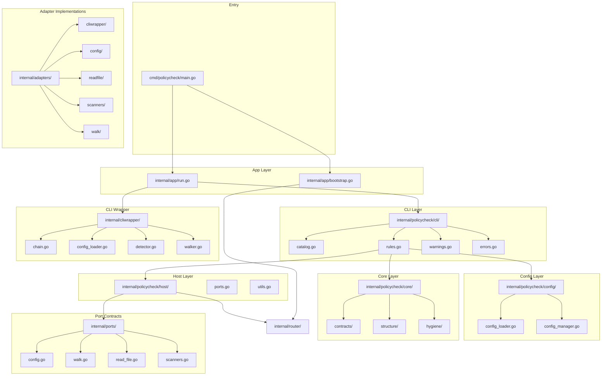

# Policycheck Codebase Review

**Date**: 2026-03-26
**Reviewer**: Kilo Code (Architect Mode)
**Scope**: Full codebase review excluding `internal/router` and `internal/tests/`

---

## Executive Summary

The policycheck codebase demonstrates a well-architected Go application following hexagonal architecture principles with clear separation of concerns. The codebase is generally well-structured, documented, and follows project conventions. However, several error handling issues were identified that violate the project's non-negotiable rules.

**Overall Assessment**: Good with specific issues to address

---

## Architecture Overview

The codebase follows a clean hexagonal architecture:

```
cmd/policycheck/main.go          → Entry point
internal/app/                    → Bootstrap & dispatch
internal/policycheck/cli/        → CLI surface
internal/policycheck/config/     → Configuration loading
internal/policycheck/core/       → Policy check implementations
internal/policycheck/host/       → Host capability resolution
internal/ports/                  → Port contracts (interfaces)
internal/adapters/               → Adapter implementations
internal/cliwrapper/             → CLI wrapper subsystem
```

### Key Design Patterns

1. **Port/Adapter Pattern**: Clear separation between contracts (interfaces) and implementations
2. **Router Integration**: Uses router-backed capabilities for config, walk, scanner, and readfile
3. **Configuration-Driven**: TOML-based configuration with strict validation
4. **Framework-Free CLI**: Uses `flag.NewFlagSet` without external CLI frameworks

---

## Strengths

### 1. Clean Architecture
- Well-structured hexagonal architecture with clear port/adapter separation
- Adapters do not import each other; cross-capability dependencies resolve through the router
- Clear package boundaries and concerns

### 2. Error Handling
- Consistent error wrapping with `fmt.Errorf("context: %w", err)` pattern throughout
- Most errors are properly propagated with context
- Error messages are actionable and include relevant context

### 3. Documentation
- All production packages have `doc.go` files with `Package Concerns:` sections
- Google-style doc comments for exported symbols
- Clear package-level documentation

### 4. Configuration
- TOML-based configuration with strict validation
- Sensible defaults applied automatically
- No hardcoded config paths; uses `fs.String("config", "policy-gate.toml", ...)`

### 5. CLI Design
- Framework-free CLI using `flag.NewFlagSet` with proper flag parsing
- No global config state or singleton caches
- Clean separation between wrapper and analysis surfaces

### 6. Policy Checks
Comprehensive policy enforcement covering:
- Scope guard (forbidden lifecycle calls)
- Hardcoded runtime knobs
- Go version validation
- Function quality (complexity, LOC, parameters)
- File size limits
- Secret logging detection
- Architecture rules
- Package rules (doc.go, file limits)
- Documentation style
- Symbol naming hygiene

### 7. Code Quality
- Uses `gofumpt` formatting (not `gofmt`)
- Compiles regexes at package scope for reuse
- Package-level constants in `UPPER_CASE`
- Function cognitive complexity generally within limits
- Functions named with at least 2 tokens

---

## Issues Found

### Issue 1: Direct `os.ReadFile` Usage in `go_version.go`

**File**: [`internal/policycheck/core/contracts/go_version.go:20-36`](internal/policycheck/core/contracts/go_version.go:20)

**Severity**: Medium

**Description**: Uses `os.ReadFile` directly instead of `host.ReadFile`. This bypasses the router-backed readfile provider and could cause issues in tests or alternate host seams.

```go
content, err := os.ReadFile(modPath)
if err != nil {
    if os.IsNotExist(err) {
        return []types.Violation{{
            RuleID:   "go-version",
            File:     "go.mod",
            Message:  "missing go.mod file",
            Severity: "error",
        }}
    }
    // Return contextual error as violation if we cannot read it
    return []types.Violation{{
        RuleID:   "go-version",
        File:     "go.mod",
        Message:  fmt.Sprintf("checkGoVersion: %v", err),
        Severity: "error",
    }}
}
```

**Recommendation**: Replace with `host.ReadFile(modPath)` to use the router-backed provider.

---

### Issue 2: Silent Walk Error Ignoring in `architecture.go`

**File**: [`internal/policycheck/core/structure/architecture.go:51`](internal/policycheck/core/structure/architecture.go:51)

**Severity**: High

**Description**: Silently ignores walk errors by returning `nil` in the callback. This violates the project's non-negotiable error handling rules.

```go
_ = walk.WalkDirectoryTree(internalBase, func(path string, d fs.DirEntry, err error) error {
    if err != nil || d.IsDir() || !strings.HasSuffix(path, ".go") {
        return nil
    }
    // ...
    return nil
})
```

**Recommendation**: Log walk errors using `log.Printf` or propagate them appropriately.

---

### Issue 3: Silent Read Error Ignoring in `package_rules.go`

**File**: [`internal/policycheck/core/structure/package_rules.go:55`](internal/policycheck/core/structure/package_rules.go:55)

**Severity**: High

**Description**: Silently ignores read errors by using `_` for the error return value. This violates the project's non-negotiable error handling rules.

```go
content, _ := host.ReadFile(path)
if utils.IsGeneratedFile(content) {
    return nil
}
```

**Recommendation**: Check and handle the error appropriately. At minimum, log the error.

---

### Issue 4: Silent Router Resolution Error in `host/utils.go`

**File**: [`internal/policycheck/host/utils.go:23-29`](internal/policycheck/host/utils.go:23)

**Severity**: Medium

**Description**: The fallback to `os.ReadFile` silently ignores the router resolution error. This could mask configuration issues.

```go
func ReadFile(name string) ([]byte, error) {
    provider, err := ResolveReadFileProvider()
    if err != nil {
        // Fallback for bootstrap/config load if router not fully booted
        return os.ReadFile(name)
    }
    return provider.ReadFile(name)
}
```

**Recommendation**: Log the router resolution error before falling back to `os.ReadFile`.

---

### Issue 5: Inconsistent Error Wrapping in `scope_guard.go`

**File**: [`internal/policycheck/core/contracts/scope_guard.go:68-70`](internal/policycheck/core/contracts/scope_guard.go:68)

**Severity**: Low

**Description**: The `scopeGuardWalkError` function creates a violation with the error message, but doesn't wrap the error with context.

```go
if err != nil {
    return scopeGuardWalkError(err)
}
```

The `scopeGuardWalkError` function:
```go
func scopeGuardWalkError(err error) []types.Violation {
    return []types.Violation{{
        RuleID:   "scope-guard",
        Message:  fmt.Sprintf("checkScopeGuard: %v", err),
        Severity: "error",
    }}
}
```

**Recommendation**: Consider wrapping the error with more context or using a consistent error handling pattern.

---

### Issue 6: Potential Cognitive Complexity in `warnings.go`

**File**: [`internal/policycheck/cli/warnings.go:329-363`](internal/policycheck/cli/warnings.go:329)

**Severity**: Low

**Description**: The `SummarizeWarnings` function has multiple nested conditionals and could be simplified.

```go
func SummarizeWarnings(cfg config.PolicyConfig, violations []types.Violation) []types.Violation {
    if !cfg.Output.MildCTXCompressSummary {
        return violations
    }

    var mildCTX []types.Violation
    var others []types.Violation

    // Separate mild CTX warnings from everything else
    for _, v := range violations {
        if v.RuleID == "function-quality.mild-ctx" {
            mildCTX = append(mildCTX, v)
        } else {
            others = append(others, v)
        }
    }

    perFileSummaries, remainingMildCTX := summarizePerFileMildCTX(cfg, mildCTX)
    others = append(others, perFileSummaries...)

    // If there are fewer than the minimum required for global summarization,
    // restore them back as regular warnings (but use the standard RuleID for output)
    if len(remainingMildCTX) < cfg.Output.MildCTXSummaryMinFunctions {
        for i := range remainingMildCTX {
            remainingMildCTX[i].RuleID = "function-quality"
        }
        return append(others, remainingMildCTX...)
    }

    // Bundle remaining low CTX warnings into a single global summary line
    count := len(remainingMildCTX)
    summary := newGlobalMildCTXSummary(cfg, count)

    return append(others, summary)
}
```

**Recommendation**: Consider extracting helper functions to reduce nesting and improve readability.

---

## Compliance with Project Rules

### ✅ Compliant

- Uses `flag.NewFlagSet` for CLI
- Wraps errors with `fmt.Errorf("context: %w", err)` in most places
- Has `doc.go` files with `Package Concerns:` sections
- Uses `gofumpt` formatting
- No CLI frameworks (Cobra, Kong, etc.)
- No global config state
- Tests live under `internal/tests/`
- Uses `fmt.Fprintf(os.Stdout, ...)` in adapters
- Compiles regexes at package scope
- Package-level constants in `UPPER_CASE`
- Functions named with at least 2 tokens
- Google-style doc comments for exported symbols

### ❌ Non-Compliant

- Silent error swallowing in specific locations (Issues 2, 3, 4)
- Direct `os.ReadFile` usage instead of `host.ReadFile` (Issue 1)

---

## Recommendations

### High Priority

1. **Fix Error Handling in `architecture.go`**: Log or propagate walk errors instead of silently ignoring them
2. **Fix Error Handling in `package_rules.go`**: Check and handle read errors instead of using `_`
3. **Fix `go_version.go`**: Use `host.ReadFile` instead of `os.ReadFile`

### Medium Priority

4. **Improve Error Context in `host/utils.go`**: Log router resolution errors before falling back
5. **Review Cognitive Complexity**: Split complex functions into smaller, focused helpers

### Low Priority

6. **Add Missing Doc Comments**: Ensure all exported functions have proper Google-style doc comments
7. **Improve Error Wrapping**: Ensure consistent error wrapping patterns across all error paths

---

## Mermaid Architecture Diagram



---

## Conclusion

The policycheck codebase is well-architected and generally follows project conventions. The main issues are related to error handling in specific locations where errors are silently ignored or not properly propagated. Addressing these issues will improve code reliability and maintainability.

The codebase demonstrates good practices in:
- Architecture and separation of concerns
- Documentation and code organization
- Configuration management
- CLI design
- Policy check implementation

With the recommended fixes, the codebase will be fully compliant with project rules and maintain high code quality standards.
