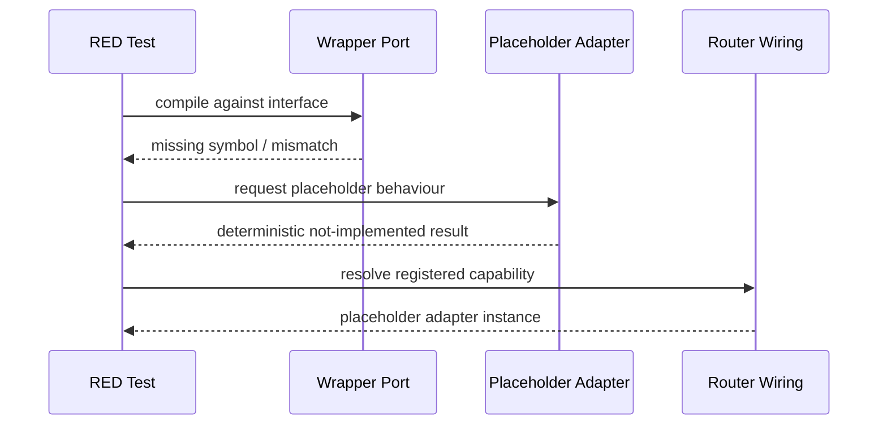
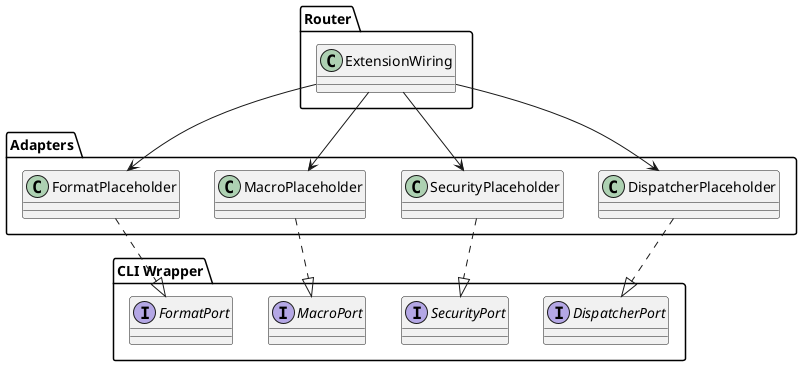

# CLI Wrapper TDD 1

## Objective

Establish the CLI-wrapper as a distinct app surface that happens to live inside the same repository as `policycheck`, but does not collapse into policycheck-specific runtime logic. This phase only creates the boundary, placeholder ports, placeholder adapters, and router-aware registration seams.

## Scope

- Create the wrapper package/module boundaries.
- Create placeholder ports for wrapper-specific capabilities.
- Create placeholder adapters that only depend on `internal/ports` and `internal/router/`.
- Add router plan steps that use `wrlk add` and existing app extension wiring, not manual router surgery.
- Keep behaviour intentionally skeletal so the first pass proves architecture before features.

## Non-Negotiables

- [ ] Treat the CLI wrapper as separate from `policycheck` domain logic even if both are exposed from the same app binary.
- [ ] Do not let adapters import each other.
- [ ] Do not let adapters import `internal/config`, `internal/command`, or `internal/adapters/*` directly.
- [ ] When router wiring starts, read `docs/router/usage.md` and `docs/router/cli-tools.md` again before touching router-owned files.
- [ ] Use `go run ./internal/router/tools/wrlk add --name <PortName> --value <string>` for new ports.
- [ ] Do not use `wrlk ext add` for this workstream.

## Testing Posture For This Phase

- [ ] Use TDD only for the implementation phase: write the smallest failing test that defines the next behaviour, make it pass, then simplify.
- [ ] Do not add broad coverage-chasing tests during early implementation.
- [ ] Do not lock in large suites around placeholder shapes that are expected to change quickly.
- [ ] Add only the tests needed to drive the next design step and protect the current behaviour.
- [ ] Defer broader integration, expansion, and cleanup-oriented test coverage until the wrapper design settles.

## File Plan

| File | Action | Purpose |
| --- | --- | --- |
| `internal/ports/cliwrapper_dispatcher_port.go` | new | Wrapper command dispatch contract |
| `internal/ports/cliwrapper_security_port.go` | new | Wrapper package-security contract placeholder |
| `internal/ports/cliwrapper_macro_port.go` | new | Wrapper macro execution contract placeholder |
| `internal/ports/cliwrapper_format_port.go` | new | Wrapper formatting contract placeholder |
| `internal/adapters/cliwrapper/doc.go` | new | Package doc for wrapper adapters |
| `internal/adapters/cliwrapper/dispatcher_placeholder.go` | new | Placeholder adapter implementation |
| `internal/adapters/cliwrapper/security_placeholder.go` | new | Placeholder security adapter |
| `internal/adapters/cliwrapper/macro_placeholder.go` | new | Placeholder macro adapter |
| `internal/adapters/cliwrapper/format_placeholder.go` | new | Placeholder fmt adapter |
| `internal/tests/cliwrapper/ports/` | new | Contract-focused tests for placeholder seams |
| `internal/tests/cliwrapper/router/` | new | Router-facing boot tests for wrapper registrations |

Note: these tests are intentionally minimal and design-driving, not a full validation matrix.

## Sequence

## Component Sketch

## TDD Cycles

### T1 Port Contracts [ ]

Summary: define wrapper-only ports with explicit names so the codebase cannot accidentally reuse policycheck-specific interfaces as a shortcut.

RED:
- [ ] Write compile-failing tests under `internal/tests/cliwrapper/ports/` that reference `CLIWrapperDispatcher`, `CLIWrapperSecurityGate`, `CLIWrapperMacroRunner`, and `CLIWrapperFormatter`.
- [ ] Assert each interface exposes only wrapper-facing methods and accepts `context.Context` where long-running execution is expected.

GREEN:
- [ ] Add the four port files under `internal/ports/`.
- [ ] Keep exported doc comments explicit that these contracts belong to the CLI-wrapper subsystem, not the policycheck engine.
- [ ] Return typed placeholder results or errors rather than silent no-ops.

REFACTOR:
- [ ] Normalize naming so every exported type is two tokens or more and clearly wrapper-scoped.
- [ ] Add `doc.go` updates if the package docs need to mention the new subsystem boundary.

Best practices and standards:
- [ ] Prefer small interfaces with one responsibility each.
- [ ] Avoid leaking router internals into port signatures.
- [ ] Keep method names stable enough for mock generation later.

Acceptance checks:
- [ ] Port tests compile and pass.
- [ ] No interface name suggests it belongs to core policycheck analysis.

### T2 Placeholder Adapters [ ]

Summary: create deterministic placeholder adapters so router integration can start before real business logic exists.

RED:
- [ ] Write tests that instantiate each placeholder adapter through its port and expect a clear `not implemented` style error with wrapper-specific context.
- [ ] Verify placeholders never panic on empty input.

GREEN:
- [ ] Add placeholder adapter files in `internal/adapters/cliwrapper/`.
- [ ] Implement minimal structs and constructors that satisfy the wrapper ports.
- [ ] Return wrapped errors such as `fmt.Errorf("cli wrapper dispatcher placeholder: %w", errNotImplemented)`.

REFACTOR:
- [ ] Extract shared placeholder sentinel errors only if multiple adapters use the same behaviour and the extraction stays local.
- [ ] Tighten comments so they describe why the placeholder exists and when it should be replaced.

Best practices and standards:
- [ ] Keep placeholders boring and explicit.
- [ ] Do not sneak real command execution into this phase.
- [ ] Avoid global state and package-level mutable registries.

Acceptance checks:
- [ ] Placeholder tests pass.
- [ ] Adapters import only `internal/ports`, `internal/router/` if required, and standard library packages.

### T3 Router Port Registration Plan [ ]

Summary: prepare router-safe steps for registering the wrapper ports without hand-editing frozen router files.

RED:
- [ ] Write only the smallest router-facing failing test needed to prove the expected wrapper ports can be resolved.
- [ ] Capture intended port names and values without building a large router test suite this early.

GREEN:
- [ ] Add the implementation doc steps that call `wrlk add` for each new wrapper port.
- [ ] Plan required application adapter wiring via existing extension wiring commands or the mutable router extension files only.
- [ ] Keep the placeholders as the initial resolved providers.

REFACTOR:
- [ ] Remove any router plan step that relies on manual edits to generated or frozen router files.
- [ ] Verify the port names stay stable and aligned with wrapper terminology.

Best practices and standards:
- [ ] Prefer router tool commands over hand edits.
- [ ] Stop immediately if router lock or scaffold output drifts from the documented shape.
- [ ] Keep router work incremental so failures are easy to isolate.
- [ ] Keep router tests narrow and behavioural; broader router verification can come later.

Acceptance checks:
- [ ] The document contains exact `wrlk add` commands for every new port.
- [ ] The document explicitly forbids `wrlk ext add`.
- [ ] The document tells the implementer to run `go run ./internal/router/tools/wrlk guide current`.

### T4 Boot Boundary Skeleton [ ]

Summary: define how the app boot path reaches the wrapper subsystem without entangling it with existing policycheck execution.

RED:
- [ ] Write a boot-level test that expects wrapper resolution to be callable independently from policycheck command execution.
- [ ] Ensure the test fails if boot logic assumes the policycheck command path is the only entry point.

GREEN:
- [ ] Add a wrapper bootstrap plan that resolves wrapper ports from the router boundary and returns early placeholder behaviour.
- [ ] Document the dispatch seam where wrapper command parsing will branch away from policycheck-specific commands.

REFACTOR:
- [ ] Collapse duplicate boot terminology so the docs consistently use `wrapper entry`, `policycheck entry`, and `shared app boot`.

Best practices and standards:
- [ ] Shared binary is acceptable; shared domain logic is not.
- [ ] Keep the boundary visible in names, package layout, and tests.
- [ ] Do not re-prove router internals in boot tests.

Acceptance checks:
- [ ] The first implementation pass can boot wrapper placeholders without real features.
- [ ] The document makes the subsystem split unambiguous.

## Verification

- [ ] `go test ./internal/tests/cliwrapper/... -count=1`
- [ ] `go run ./internal/router/tools/wrlk guide current`
- [ ] `go run ./cmd/policycheck`

Verification note: during this phase, passing the current RED-GREEN cycle matters more than expanding the test surface.

## Exit Criteria

- [ ] Wrapper ports exist.
- [ ] Placeholder adapters exist.
- [ ] Router registration steps are documented and tool-driven.
- [ ] The wrapper is visibly separate from policycheck business logic.
