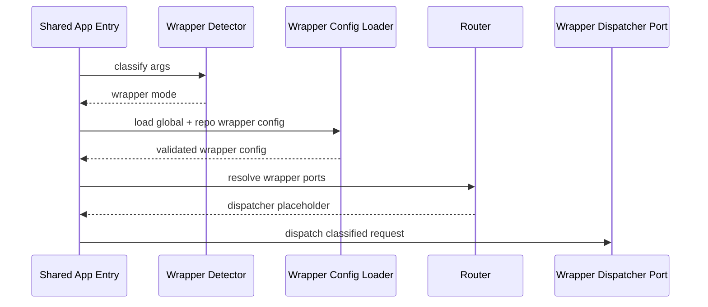
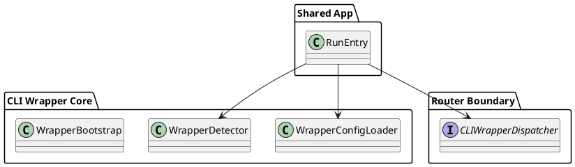

# CLI Wrapper TDD 2

## Objective

Build the wrapper control plane: config resolution, wrapper command classification, and router-resolved orchestration. This phase should still avoid real package installation or macro execution. The goal is to prove that wrapper requests flow through their own config and dispatch pipeline.

## Scope

- Add wrapper-specific config shapes and loader behaviour.
- Resolve repo and global config for wrapper use.
- Classify incoming CLI input into wrapper modes.
- Keep policycheck analysis entrypoints untouched unless they are explicitly delegated to from the shared top-level app.

## Testing Posture For This Phase

- [x] Use tests only to drive the next config or dispatch design decision.
- [x] Avoid building broad regression suites around config and bootstrap code that is still likely to be simplified.
- [x] Prefer one focused RED test per behaviour slice over many anticipatory cases.
- [x] Defer fuller regression and integration coverage until the wrapper control plane stabilizes.

## Dependencies

- `docs/command/cli-wrapper-TDD-1.md`
- `docs/router/cli-tools.md`

## File Plan

| File | Action | Purpose |
| --- | --- | --- |
| `internal/cliwrapper/doc.go` | new | Wrapper application-layer docs |
| `internal/cliwrapper/config.go` | new | Wrapper-only config structs and validation |
| `internal/cliwrapper/config_loader.go` | new | Global + repo config loading for wrapper |
| `internal/cliwrapper/detector.go` | new | Classify passthrough, package gate, tooling gate, macro, fmt |
| `internal/tests/cliwrapper/config/config_loader_test.go` | new | RED/GREEN config tests |
| `internal/tests/cliwrapper/detector/detector_test.go` | new | RED/GREEN mode detection tests |
| `internal/tests/cliwrapper/boot/boot_test.go` | new | Router-resolved wrapper boot tests |

## Sequence

## Component Sketch

## TDD Cycles

### T1 Wrapper Config Schema [x]

Summary: define a wrapper-local schema so wrapper policies do not piggyback on policycheck config semantics by accident.

RED:
- [x] Write tests that fail until wrapper config structs support `security`, `tooling.gates`, `macros`, and `ui`.
- [x] Add validation tests for repo config trying to become less strict than global config.

GREEN:
- [x] Implement wrapper config structs under `internal/cliwrapper/config.go`.
- [x] Support wrapper-local validation helpers for severity ordering and macro shape.
- [x] Keep the schema separate from existing policycheck analysis config types unless reuse is deliberate and documented.

REFACTOR:
- [x] Normalize severity helpers into small reusable functions.
- [x] Remove duplicated validation logic from tests once behaviour is stable.

Best practices and standards:
- [x] Add doc comments for exported types.
- [x] Wrap parse and validation errors with file-scope context.
- [x] Keep config structs intentionally narrow for this subsystem.

Acceptance checks:
- [x] Tests prove the wrapper config can evolve independently.
- [x] The phase does not require real command execution yet.

### T2 Wrapper Config Loader [x]

Summary: load global and repo config for the wrapper using upward repo-root resolution and documented merge rules.

RED:
- [x] Write the minimum set of failing tests needed to define global-only load, repo override, and invalid threshold relaxation.
- [x] Add only the essential fallback test for missing repo config.

GREEN:
- [x] Implement `config_loader.go` with explicit load order.
- [x] Walk upward from the current working directory to locate `policy-gate.toml`.
- [x] Merge repo config over global config while enforcing the stricter-only security rule.

REFACTOR:
- [x] Split file lookup from merge logic if the loader becomes complex.
- [x] Keep cognitive complexity within repository limits.

Best practices and standards:
- [x] No singleton config cache.
- [x] Fresh config load per command.
- [x] Return actionable errors that identify whether global or repo config failed.
- [x] Do not expand the test matrix beyond what the current implementation step needs.

Acceptance checks:
- [x] Loader tests pass.
- [x] Missing repo config falls back to global-only behaviour.

### T3 Wrapper Mode Detection [x]

Summary: classify incoming args into wrapper modes before any adapter executes.

RED:
- [x] Write only the focused failing tests needed to distinguish `run`, `fmt headers`, package installs, `-then`, and passthrough.
- [x] Keep the `go test` passthrough case as a single explicit regression guard.

GREEN:
- [x] Implement `detector.go`.
- [x] Return a small enum or typed mode for `Passthrough`, `PackageGate`, `ToolingGate`, `MacroRun`, and `FormatHeaders`.
- [x] Keep the detection rules deterministic and easy to extend.

REFACTOR:
- [x] Extract manager and subcommand tables if hard-coded branching becomes noisy.
- [x] Remove duplicated normalization logic across tests and implementation.

Best practices and standards:
- [x] Prefer table-driven tests.
- [x] Do not infer wrapper intent from shell syntax the process never receives.
- [x] Treat unknown commands as passthrough by default.
- [x] Keep tables small while the classification rules are still evolving.

Acceptance checks:
- [x] The detector can route wrapper features without touching real execution logic.
- [x] Tests document the subsystem boundary clearly.

### T4 Router-Resolved Wrapper Bootstrap [x]

Summary: prove the shared app boot can classify wrapper work, load wrapper config, resolve wrapper ports, and hand off to the wrapper subsystem.

RED:
- [x] Write a boot test that expects the wrapper dispatcher port to be resolved and invoked when wrapper mode is selected.
- [x] Write a separate test that expects normal policycheck execution to remain unaffected for policycheck-specific commands.

GREEN:
- [x] Add the bootstrap seam in the shared app layer.
- [x] Resolve wrapper dependencies through the router boundary only.
- [x] Pass a wrapper request object that contains the classified mode, raw args, cwd, and loaded config.

REFACTOR:
- [x] Tighten request and response types so later phases can add execution details without widening every call signature.

Best practices and standards:
- [x] Shared entrypoint, separate request model.
- [x] No direct adapter imports from the shared boot path.
- [x] Boot tests should focus on selection logic, not adapter internals.
- [x] Resist adding extra boot permutations until the handoff seam has settled.

Acceptance checks:
- [x] Wrapper bootstrap tests pass.
- [x] Policycheck-only commands still follow their existing path.

## Verification

- [x] `go test ./internal/tests/cliwrapper/config/... -count=1` — 13/13 PASS
- [x] `go test ./internal/tests/cliwrapper/detector/... -count=1` — 11/11 PASS
- [x] `go test ./internal/tests/cliwrapper/boot/... -count=1` — 5/5 PASS
- [x] `go run ./cmd/policycheck` — no new ERRORs (pre-existing WARNs only)

Verification note: stop after the targeted TDD cycle passes; do not inflate this phase with coverage-oriented follow-up tests.

## Exit Criteria

- [x] Wrapper config loads independently.
- [x] Wrapper mode detection is stable.
- [x] Shared app boot can hand off to wrapper placeholders through the router.
