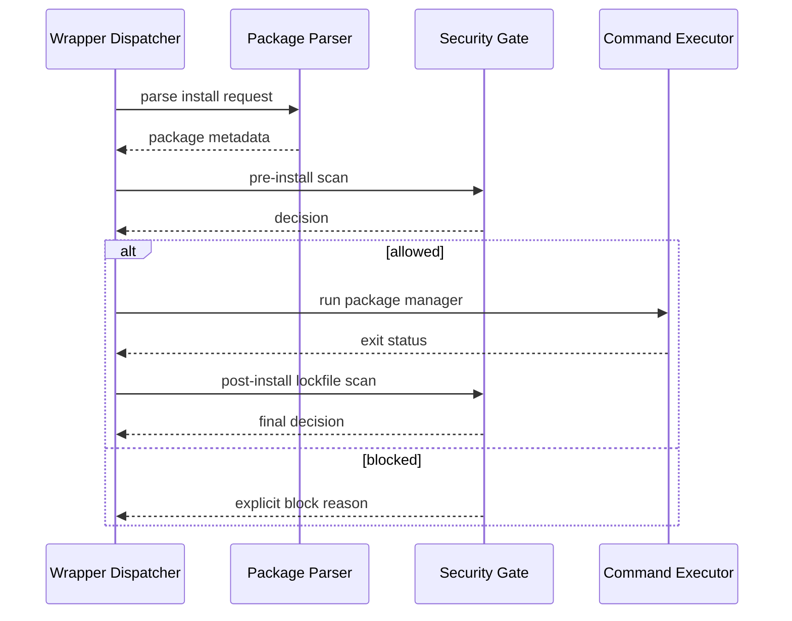
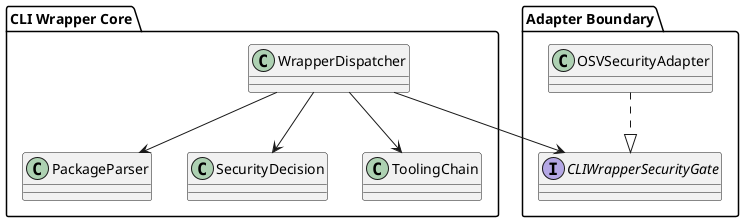

# CLI Wrapper TDD 3

## Objective

Implement the real execution backbone for the wrapper: package-security gating, tooling `-then` chains, and subprocess cleanup rules. This phase turns the earlier placeholders into working behaviour while preserving the wrapper boundary from policycheck’s own analysis flow.

## Scope

- Parse package-manager commands into wrapper install requests.
- Run pre-install and post-install security checks through the wrapper security port.
- Implement tooling gate chains using `-then`.
- Enforce process cleanup and explicit error reporting.

## Testing Posture For This Phase

- [x] Keep tests tightly coupled to the behaviour currently being designed.
- [x] Do not add large scenario matrices for parser, gate, or chain logic while those flows are still being simplified.
- [x] Prefer the fewest RED cases that force a clean design.
- [x] Defer exhaustive permutations, wide regression sweeps, and coverage work until the execution model is stable.

## Dependencies

- `docs/command/cli-wrapper-TDD-1.md`
- `docs/command/cli-wrapper-TDD-2.md`
- `docs/command/policycheck-cli-wrapper-design.md`

## File Plan

| File | Action | Purpose |
| --- | --- | --- |
| `internal/cliwrapper/request.go` | new | Wrapper request/value types |
| `internal/cliwrapper/package_parser.go` | new | Parse package manager commands and versions |
| `internal/cliwrapper/severity.go` | new | Security decision helpers |
| `internal/cliwrapper/chain.go` | new | `-then` orchestration and cleanup |
| `internal/adapters/cliwrapper/security_osv.go` | new/update | OSV-backed security adapter |
| `internal/adapters/cliwrapper/dispatcher.go` | new/update | Real dispatcher orchestration |
| `internal/tests/cliwrapper/package/package_parser_test.go` | new | Parser tests |
| `internal/tests/cliwrapper/security/security_gate_test.go` | new | Gate decision tests |
| `internal/tests/cliwrapper/chain/chain_test.go` | new | Tooling chain tests |
| `internal/tests/cliwrapper/dispatch/dispatcher_test.go` | new | End-to-end wrapper dispatch tests |

## Sequence

## Component Sketch

## TDD Cycles

### T1 Package Command Parsing [x]

Summary: convert raw args into explicit package install requests that the wrapper can validate and scan.

RED:
- [x] Write only the minimal failing tests needed to establish support for the intended managers and one invalid-path failure.
- [x] Add version handling only where the current parser step requires it.

GREEN:
- [x] Implement `package_parser.go`.
- [x] Return ecosystem, manager, action, package names, explicit versions, and expected lockfile hints.
- [x] Wrap parser failures with actionable context.

REFACTOR:
- [x] Extract package-manager metadata tables if branching gets repetitive.
- [x] Keep request structs compact and serializable for logs/tests.

Best practices and standards:
- [x] Avoid shell-dependent parsing.
- [x] Preserve raw args for error reporting.
- [x] Prefer pure functions for parsing and classification.
- [x] Grow the parser test set only when a new branch is introduced by the design.

Acceptance checks:
- [x] Parser tests cover all supported managers.
- [x] Unsupported input fails loudly.

### T2 Security Decision Engine [x]

Summary: enforce severity policies consistently before and after installs.

RED:
- [x] Write the smallest set of failing tests needed to establish block, allow, and scanner-failure behaviour.
- [x] Add warning and prompt branches only when the implementation reaches them.

GREEN:
- [x] Implement security decision helpers and the real security adapter path.
- [x] Support CLI binary lookup first and API fallback second if the design still requires both.
- [x] Return structured results with severity, advisories, and the chosen action.

REFACTOR:
- [x] Separate transport concerns from severity policy so adapter tests stay focused.
- [x] Extract JSON parsing helpers if OSV responses make the adapter noisy.

Best practices and standards:
- [x] Fail loud if scanning cannot complete.
- [x] Never downgrade a block to a warning implicitly.
- [x] Keep advisory rendering deterministic for tests.
- [x] Avoid speculative test branches for behaviour not yet committed in code.

Acceptance checks:
- [x] A blocked vulnerability prevents package execution.
- [x] A scanner failure also blocks package execution.

### T3 Tooling Gate Chains [x]

Summary: implement `command -then command` execution with stop-on-failure semantics and child cleanup.

RED:
- [x] Write the minimal failing tests for gate-fails-stop, gate-passes-run, and one cleanup path.
- [x] Defer broader process-edge-case testing until the chain implementation stabilizes.

GREEN:
- [x] Implement `chain.go`.
- [x] Split args at `-then`, execute the gate command first, and execute the main command only on success.
- [x] Track subprocess handles or groups so cleanup is reliable.

REFACTOR:
- [x] Consolidate process cleanup into a helper shared with package and macro execution if the shape matches.
- [x] Tighten exit-code mapping so wrapper errors and child-process failures are distinguishable.

Best practices and standards:
- [x] No silent subprocess leakage.
- [x] Use explicit context cancellation where practical.
- [x] Avoid platform-specific assumptions leaking into core logic.
- [x] Keep subprocess tests lean; only add more when a defect or new branch appears.

Acceptance checks:
- [x] Chain tests pass.
- [x] Cleanup behaviour is exercised in tests, not left as documentation only.

### T4 Real Wrapper Dispatcher [x]

Summary: replace the placeholder dispatcher with the first working wrapper orchestrator for package and tooling flows.

RED:
- [x] Write only the focused failing tests needed to prove package dispatch, tooling dispatch, and policycheck separation.
- [x] Add passthrough coverage only when that branch is actively being implemented in this phase.

GREEN:
- [x] Implement the real dispatcher adapter.
- [x] Route package install requests through parser, security gate, executor, and post-install scan.
- [x] Route `-then` chains through the tooling-chain helper.

REFACTOR:
- [x] Keep the dispatcher orchestration thin by moving policy decisions into focused helpers.
- [x] Remove placeholder-only branches that no longer carry their weight.

Best practices and standards:
- [x] Keep the dispatcher as coordinator, not policy dump.
- [x] Preserve raw child output where useful for debugging.
- [x] Wrap every error with the current stage.
- [x] Do not build a large dispatcher regression suite before the orchestration settles.

Acceptance checks:
- [x] Dispatcher tests pass.
- [x] Wrapper execution is real for package and tooling modes.

## Verification

- [x] `go test ./internal/tests/cliwrapper/package/... -count=1`
- [x] `go test ./internal/tests/cliwrapper/security/... -count=1`
- [x] `go test ./internal/tests/cliwrapper/chain/... -count=1`
- [x] `go test ./internal/tests/cliwrapper/dispatch/... -count=1`
- [x] `go run ./cmd/policycheck`

Verification note: the goal here is working behaviour through TDD, not broad execution-path coverage.

## Exit Criteria

- [x] Package manager interception works.
- [x] Security gates work.
- [x] Tooling chains work.
- [x] Wrapper execution remains separate from policycheck analysis behaviour.
