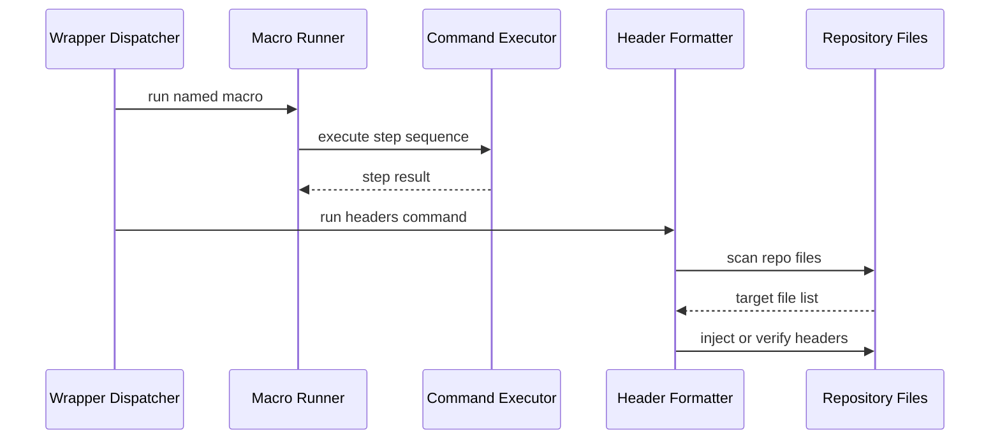
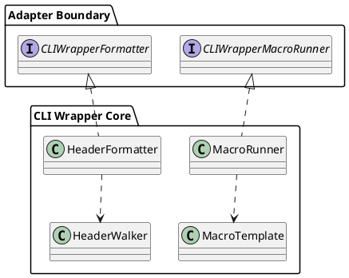

# CLI Wrapper TDD 4

## Objective

Finish the wrapper feature set with macros, `fmt headers`, router hardening, and integration verification. This phase should leave the CLI wrapper operational as its own subsystem, still sharing the app binary but not the policycheck domain model.

## Scope

- Implement `run` macros.
- Implement `fmt headers`.
- Finalize router-backed adapter wiring for the real wrapper adapters.
- Add integration and regression coverage around boundary rules.

## Testing Posture For This Phase

- [x] Continue using TDD for the next behaviour slice only.
- [x] Keep integration coverage narrow and only where it is needed to prove router wiring or subsystem separation.
- [x] Do not chase coverage percentages.
- [x] Defer broad post-implementation hardening suites until the wrapper functionality and shape stop moving.

## Dependencies

- `docs/command/cli-wrapper-TDD-1.md`
- `docs/command/cli-wrapper-TDD-2.md`
- `docs/command/cli-wrapper-TDD-3.md`
- `docs/router/cli-tools.md`

## File Plan

| File                                                   | Action     | Purpose                              |
| ------------------------------------------------------ | ---------- | ------------------------------------ |
| `internal/cliwrapper/template.go`                      | new        | Macro template interpolation         |
| `internal/cliwrapper/macro_runner.go`                  | new        | Macro execution core                 |
| `internal/cliwrapper/header.go`                        | new        | Header detection and injection       |
| `internal/cliwrapper/walker.go`                        | new        | Repo file discovery and skip logic   |
| `internal/adapters/cliwrapper/macro_runner.go`         | new/update | Router-resolved macro adapter        |
| `internal/adapters/cliwrapper/format_headers.go`       | new/update | Router-resolved fmt adapter          |
| `internal/tests/cliwrapper/macro/macro_runner_test.go` | new        | Macro tests                          |
| `internal/tests/cliwrapper/fmt/header_test.go`         | new        | Header logic tests                   |
| `internal/tests/cliwrapper/fmt/walker_test.go`         | new        | Walker tests                         |
| `internal/tests/cliwrapper/integration/`               | new        | Router and wrapper integration tests |

## Sequence

## Component Sketch

## TDD Cycles

### T1 Macro Templates and Execution [ ]

Summary: implement named wrapper macros without letting them drift into generic app orchestration.

RED:
- [x] Write the smallest set of failing tests needed to establish macro execution, stop-on-failure, and template substitution.
- [x] Add config-resolution tests only when the macro path depends on them directly.

GREEN:
- [x] Implement `template.go` and `macro_runner.go`.
- [x] Support prompt-free variable injection from provided arguments first; interactive prompting can remain a later enhancement if not required immediately.
- [x] Return aggregate failure context when `on_failure = "continue"` still encounters errors.

REFACTOR:
- [x] Share subprocess cleanup helpers with tooling/package execution if the contract is already stable.
- [x] Keep macro parsing separate from command execution.

Best practices and standards:
- [x] Every failing step must surface its command text.
- [x] Child process cleanup remains mandatory.
- [x] Avoid hidden mutation of wrapper config during runtime.
- [x] Keep macro tests focused on the next behaviour, not the eventual full matrix.

Acceptance checks:
- [x] Macro runner tests pass.
- [x] Macro execution stays inside the wrapper subsystem.

### T2 `fmt headers` Core Logic [x]

Summary: implement idempotent repository header maintenance for Go, Python, and TypeScript.

RED:
- [x] Write only the minimal failing tests needed to establish one header path per supported language and one idempotence check.
- [x] Expand skip-directory and dry-run cases only as the implementation reaches them.

GREEN:
- [x] Implement `header.go` and `walker.go`.
- [x] Detect stale or missing headers and inject the correct repo-relative path comment.
- [x] Support dry-run reporting without file writes.

REFACTOR:
- [x] Extract language-specific header rules into small helpers if the file becomes branch-heavy.
- [x] Keep filesystem traversal separate from content mutation.

Best practices and standards:
- [x] Never modify skipped directories.
- [x] Preserve Python shebangs.
- [x] Make dry-run output deterministic for test assertions.
- [x] Avoid front-loading every filesystem case before the formatter shape is stable.

Acceptance checks:
- [x] Header and walker tests pass.
- [x] A second write run reports zero modifications.

### T3 Router Wiring for Real Adapters [x]

Summary: replace placeholder adapter registrations with the real wrapper adapters using the approved router tooling workflow.

RED:
- [x] Add router integration tests that fail until the dispatcher, security, macro, and fmt ports resolve to real adapters.
- [x] Add a regression test proving no adapter imports another adapter to obtain dependencies.

GREEN:
- [x] Run the documented `wrlk add` commands for any remaining ports.
- [x] Wire real application adapters through the mutable router extension path, following `docs/router/cli-tools.md`.
- [x] Verify the router inventory with `go run ./internal/router/tools/wrlk guide current`.

REFACTOR:
- [x] Remove stale placeholder registrations and dead code once the real adapters are wired.
- [x] Tighten package docs so ownership of router-wired adapters is obvious.

Best practices and standards:
- [x] Do not edit frozen router files by hand.
- [x] Stop if router lock output drifts.
- [x] Keep adapter imports restricted to ports and router seams.
- [x] Keep router integration tests to a minimum required proof set.

Acceptance checks:
- [x] Router integration tests pass.
- [x] `guide current` shows the intended wrapper capabilities.

### T4 Integration and Completion Gate [x]

Summary: prove the wrapper works as a coherent subsystem and does not regress policycheck.

RED:
- [x] Add only the minimal final proof tests needed to show wrapper/policycheck separation and one end-to-end success path per implemented feature.
- [x] Leave broader regression expansion for a later hardening phase if real defects justify it.

GREEN:
- [x] Implement any missing seams exposed by the integration failures.
- [x] Add concise user-facing output formatting for wrapper actions and block reasons.
- [x] Document the final command surface in the docs if implementation details changed from the original design.

REFACTOR:
- [x] Remove duplicated execution helpers across wrapper features.
- [x] Keep integration fixtures small and explicit.

Best practices and standards:
- [x] Prefer targeted integration tests over broad fragile end-to-end scripts.
- [x] Keep wrapper logs readable but deterministic.
- [x] Do not broaden the scope into policycheck analysis internals.
- [x] Treat this as a thin completion gate, not a coverage sweep.

Acceptance checks:
- [x] Integration tests pass.
- [x] Wrapper and policycheck paths coexist without domain leakage.

## Verification

- [x] `go test ./internal/tests/cliwrapper/macro/... -count=1`
- [x] `go test ./internal/tests/cliwrapper/fmt/... -count=1`
- [x] `go test ./internal/tests/cliwrapper/integration/... -count=1`
- [x] `go run ./internal/router/tools/wrlk guide current`
- [x] `go run ./cmd/policycheck`

## Exit Criteria

- [x] Macros work.
- [x] `fmt headers` works.
- [x] Real adapters are router-wired.
- [x] Integration coverage protects the wrapper/policycheck boundary.
