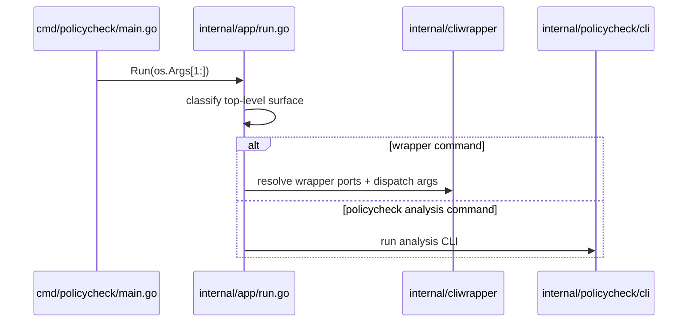

# CLI Wrapper TDD 5

## Objective

Connect the existing wrapper subsystem to the real `policycheck` binary so the command surface described in `policycheck-cli-wrapper-design.md` becomes reachable from the shared entrypoint.

## Scope

- Add a shared top-level command router for `policycheck`.
- Route wrapper commands to the wrapper subsystem before policycheck analysis parsing runs.
- Keep `policycheck check` and existing analysis flags working.
- Do not redesign router internals or wrapper adapter boundaries in this phase.

## Task Checklist

- [ ] Add `internal/app/run.go` as the shared binary dispatch seam.
- [ ] Route wrapper commands through `internal/cliwrapper` from the real binary.
- [ ] Preserve policycheck analysis commands through the shared app layer.
- [ ] Decide and implement the explicit analysis command shape (`check` or equivalent).
- [ ] Add focused app-layer tests for wrapper-vs-analysis selection.
- [ ] Verify wrapper features are reachable from `go run ./cmd/policycheck`.

## Why This Phase Exists

The current codebase contains working wrapper internals, but [`cmd/policycheck/main.go`](C:/Users/micha/.syntx/go/policyengine/cmd/policycheck/main.go) still always delegates to the policycheck analysis CLI. The design doc promises a shared binary with multiple surfaces; this phase makes that true.

## Dependencies

- `docs/command/policycheck-cli-wrapper-design.md`
- `docs/command/cli-wrapper-TDD-1.md`
- `docs/command/cli-wrapper-TDD-2.md`
- `docs/command/cli-wrapper-TDD-3.md`
- `docs/command/cli-wrapper-TDD-4.md`

## File Plan

| File | Action | Purpose |
| --- | --- | --- |
| `internal/app/run.go` | new | Shared binary dispatch between wrapper and policycheck analysis surfaces |
| `internal/app/doc.go` | update | Document shared app command routing concern |
| `cmd/policycheck/main.go` | update | Call app-level run seam instead of policycheck-only CLI |
| `internal/cliwrapper/wrapperboot.go` | update | Expose the narrow wrapper handoff seam needed by the app layer |
| `internal/policycheck/cli/rules.go` | update | Reserve explicit analysis entry surface such as `check` if required |
| `internal/tests/app/run/` | new | TDD coverage for shared entrypoint routing |

## Sequence

## TDD Cycles

### T1 Shared Surface Selection [ ]

Summary: teach the binary to distinguish wrapper commands from policycheck analysis commands without forcing everything through the analysis flag parser first.

RED:
- [ ] Write a failing test where `policycheck uv add fastapi` is sent to the wrapper dispatcher.
- [ ] Write a failing test where `policycheck --policy-list` still stays on the analysis path.
- [ ] Write a failing test for explicit `policycheck check`.

GREEN:
- [ ] Add an app-level `Run(args []string) int` seam under `internal/app/`.
- [ ] Route wrapper commands through `WrapperBootEntry` and the dispatcher port.
- [ ] Route policycheck analysis commands to the existing analysis CLI.

REFACTOR:
- [ ] Keep top-level classification small and explicit.
- [ ] Avoid duplicating wrapper detector logic inside the analysis package.

Acceptance checks:
- Wrapper commands become reachable from the real binary.
- Existing analysis commands still work.

### T2 Explicit Analysis Command Shape [ ]

Summary: align the analysis surface with the shared-binary design so wrapper commands and policy checks are not competing for the same raw arg space.

RED:
- [ ] Write a failing test that `policycheck check --policy-list` is accepted if that is the chosen explicit analysis surface.
- [ ] Write a failing test that bare wrapper commands do not require a `check` prefix.

GREEN:
- [ ] Introduce or normalize an explicit analysis subcommand if needed.
- [ ] Preserve backward compatibility only when it does not blur the wrapper boundary.

REFACTOR:
- [ ] Simplify analysis CLI parsing after the shared app router owns top-level dispatch.

Acceptance checks:
- The binary command model matches the design doc more closely.
- The shared entrypoint is no longer policycheck-analysis-only.

### T3 End-to-End Binary Reachability [ ]

Summary: prove the implemented wrapper features are actually reachable through `cmd/policycheck`.

RED:
- [ ] Add a focused end-to-end test for `policycheck fmt headers --dry-run`.
- [ ] Add a focused end-to-end test for `policycheck run <macro>`.
- [ ] Add a focused end-to-end test for `policycheck <tool> ... -then ...`.
- [ ] Keep them narrow and seam-driven, not shell-heavy.

GREEN:
- [ ] Wire the remaining app-layer seams needed for command execution and exit codes.

REFACTOR:
- [ ] Normalize error rendering between wrapper and analysis paths.

Acceptance checks:
- The binary now exposes the wrapper surface promised by the design doc.

## Verification

- `go test ./internal/tests/app/... -count=1`
- `go test ./internal/tests/cliwrapper/... -count=1`
- `go run ./cmd/policycheck --policy-list`
- `go run ./cmd/policycheck fmt headers --dry-run`

## Exit Criteria

- Wrapper commands are reachable from the real binary.
- Policycheck analysis remains reachable as its own surface.
- Shared entrypoint ownership lives in `internal/app`, not feature packages.
