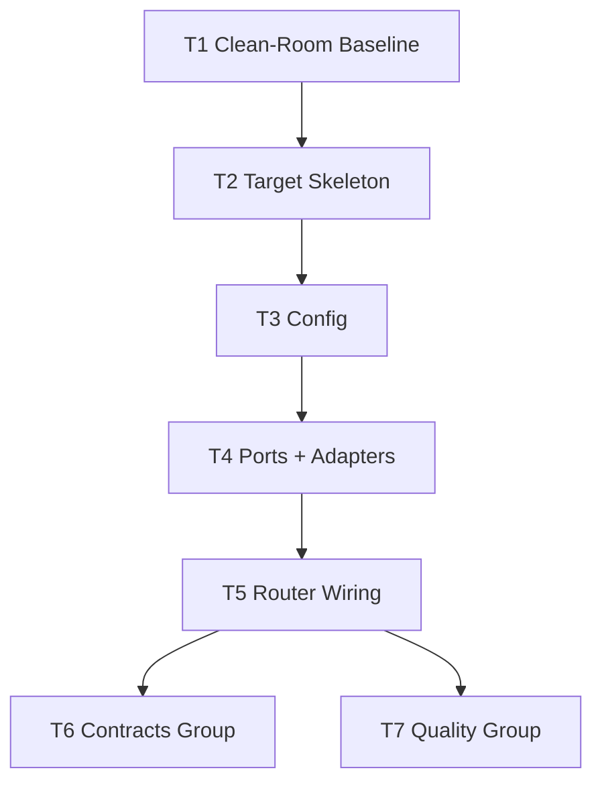
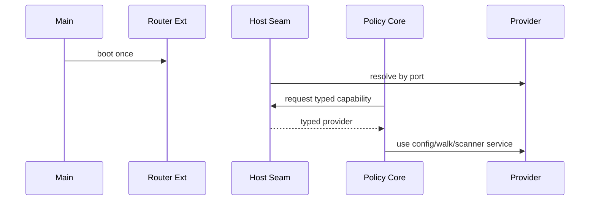
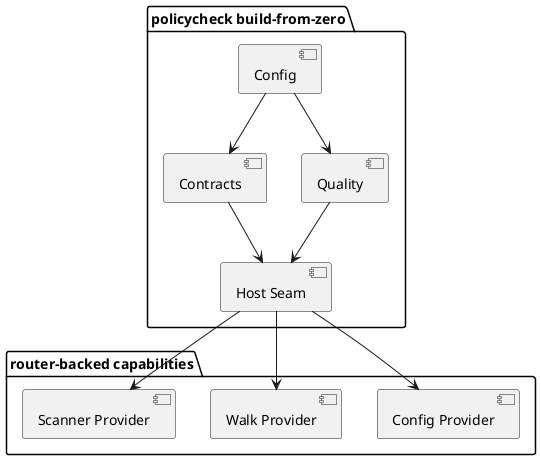
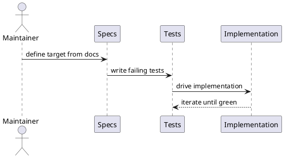

# policycheck Rewrite - Tasklist Plan A

See also `docs/policycheck/policycheck-tasklist-B.md` for the second half.

---

## Overview

This plan assumes **zero trusted implementation files**.

Work from the specs outward:

1. trust `AGENTS.md`
2. trust `docs/router/usage.md`
3. trust `docs/policycheck/policycheck-design.md`
4. trust `docs/policycheck/policycheck-TDD.md`
5. trust nothing else until it is inspected against those documents

The purpose of this plan is to stop "quick fixes" in router wiring from
becoming architecture damage.

Hard rules:

- do not infer architecture from existing files without checking the docs
- do not edit router core to make policycheck compile
- `WRLK EXT ADD` IS NOT TO BE USED
- do not let adapters import each other
- do not start with refactors; start with contracts, tests, and seams

---

## Plan Overview

| Task ID | Goal                                                  | Owner         | Depends On | Risk   |
| ------- | ----------------------------------------------------- | ------------- | ---------- | ------ |
| T1      | Establish a clean-room baseline                       | AI/maintainer | -          | Low    |
| T2      | Define target folders and contracts before code moves | AI            | T1         | Medium |
| T3      | Build config from spec, not from legacy assumptions   | AI            | T2         | Medium |
| T4      | Build host capability ports and adapters              | AI            | T3         | High   |
| T5      | Wire router usage last and minimally                  | AI            | T4         | High   |
| T6      | Build contracts group from the spec                   | AI            | T5         | Medium |
| T7      | Build quality group from the spec                     | AI            | T5         | High   |

---

## Tasks

### T1 Establish a Clean-Room Baseline [x]

Summary:
Start as if there is no reliable implementation. The only trusted sources are
the docs and repo rules.

Inputs/Outputs:
- Input: `AGENTS.md`, router usage guide, design doc, TDD doc
- Output: fixed implementation order and explicit "do not trust existing file shape" rule

File changes:
- update tasklist docs only if scope or order is wrong

Best practices and standards:
- inspect existing files only after the target shape is defined from docs
- write down the target before comparing to current code
- treat router as infrastructure to consume, not a problem to solve
- reject any shortcut that edits router core to compensate for bad dependencies

Acceptance checks:
- execution order is fixed
- team/AI guidance explicitly says the docs are the source of truth

### T2 Define the Target Skeleton Before Touching Legacy Code [x]

Summary:
Create the target package map, port list, and group list from the design doc
before using any existing implementation as reference.

Inputs/Outputs:
- Input: design Sections 3.1-3.7
- Output: target skeleton for packages, groups, ports, and test locations

File changes:
- create or update docs that record the target structure if needed
- do not edit implementation files yet unless required to add missing package skeletons

Best practices and standards:
- decide package boundaries from the design doc, not from current file contents
- identify all router-facing capabilities before wiring any adapter
- define tests under `internal/tests/` before implementation layout drifts
- keep router usage separate from policy package layout

Acceptance checks:
- target package tree is known
- target test tree is known
- router-facing capability list is known: config, walk, scanner

### T3 Build Config From Spec First [x]

Summary:
Implement the rewrite config surface directly from the design doc, without
assuming legacy config code is correct.

Inputs/Outputs:
- Input: design config map and TDD config cases
- Output: config structs, defaults, and validation aligned to the spec

File changes:
- create/update config structs in the repo config package
- create/update config loader/manager files
- create tests under `internal/tests/policycheck/config/`

Best practices and standards:
- write failing defaults and validation tests first
- compile regexes at load time
- preserve legacy behavior only through explicit defaults
- make every cross-field rule visible in validation tests

Acceptance checks:
- config tests pass
- new structs exist for every spec-added config block
- invalid regex and invalid thresholds fail with context

### T4 Build Host Capability Ports and Adapters [x]

Summary:
Define the capability contracts and adapters before touching router wiring.

Inputs/Outputs:
- Input: router usage guide and design host-capability sections
- Output: typed contracts for config, walk, and scanner plus concrete adapters

File changes:
- create `internal/ports/config.go`
- create `internal/ports/walk.go`
- create `internal/ports/scanners.go`
- create `internal/adapters/config/*`
- create `internal/adapters/walk/*`
- create `internal/adapters/scanners/*`
- create `internal/policycheck/host/*`
- create tests under `internal/tests/policycheck/host/` and `internal/tests/policycheck/walk/`

Best practices and standards:
- adapters must depend on their contract, not on each other
- if an adapter needs another capability, stop and route it through a port
- keep scanner subprocess logic entirely inside the scanner adapter
- keep `internal/policycheck/host` as the only place that turns router providers into typed services

Acceptance checks:
- three capability contracts exist
- three adapters exist behind those contracts
- policy code can depend on host services without direct adapter imports

### T5 Wire Router Usage Last and Minimally [x]

Summary:
Only after ports and adapters exist should router wiring be added.

Inputs/Outputs:
- Input: router usage guide and finished contracts/adapters from T4
- Output: minimal router registration for policycheck capabilities

File changes:
- update mutable router wiring files only
- do not edit router core unless explicitly required and approved

Best practices and standards:
- use router tooling for new ports where required
- `WRLK EXT ADD` IS NOT TO BE USED
- follow import direction exactly:
  - consumer -> `internal/ports` + `internal/router`
  - host boot -> `internal/router/ext`
  - router wiring -> `internal/adapters/*`
- never make adapters import each other to "save time"
- if router wiring looks incompatible with docs, stop and report drift

Acceptance checks:
- router wiring resolves config, walk, and scanner providers
- no adapter-to-adapter import path was introduced
- policycheck can consume resolved providers through the host seam

### T6 Build the Contracts Group From the Spec [x]

Summary:
Create the contracts group as if the current implementation did not exist.

Inputs/Outputs:
- Input: design policy descriptions and TDD cases for go version, CLI formatter, AI compatibility, scope guard
- Output: pure logic plus thin orchestrators for the contracts group

File changes:
- create `internal/policycheck/core/contracts/go_version.go`
- create `internal/policycheck/core/contracts/cli_formatter.go`
- create `internal/policycheck/core/contracts/ai_compatibility.go`
- create `internal/policycheck/core/contracts/scope_guard.go`
- create tests under `internal/tests/policycheck/core/contracts/`

Best practices and standards:
- write pure tests before orchestration tests
- do not let file placement mirror old mixed-concern files
- preserve violation message wording once established
- route file reads and provider access through the host seam only

Acceptance checks:
- contract unit and integration tests pass
- contracts group is single-concern
- no direct adapter wiring exists in policy logic

### T7 Build the Quality Group From the Spec [x]

Summary:
Create the quality group from the threshold tables and scanner-boundary design.

Inputs/Outputs:
- Input: design Section 2.5, quality-group design, and TDD tables
- Output: file-size and function-quality checks with pure threshold logic

File changes:
- create `internal/policycheck/core/quality/file_size.go`
- create `internal/policycheck/core/quality/func_quality.go`
- create tests under `internal/tests/policycheck/core/quality/`

Best practices and standards:
- encode every threshold boundary from the spec as a test row
- keep scanner invocation out of quality logic
- isolate threshold math into pure functions
- avoid reusing legacy helpers until they are proven to match the spec

Acceptance checks:
- threshold tables are fully represented in tests
- pure quality logic is independent of filesystem and subprocesses
- orchestrators consume host seam inputs only

---

## File Inventory

| File                                          | Type   | Classes (main methods) | Main functions (signature)                                                                           | Purpose                                    |
| --------------------------------------------- | ------ | ---------------------- | ---------------------------------------------------------------------------------------------------- | ------------------------------------------ |
| `docs/policycheck/policycheck-tasklist-A.md`  | new    | -                      | -                                                                                                    | clean-room execution checklist, first half |
| `internal/ports/config.go`                    | create | interface contract     | provider method signatures                                                                           | config contract                            |
| `internal/ports/walk.go`                      | create | interface contract     | `WalkDirectoryTree(root string, walkFn fs.WalkDirFunc) error`                                        | walk contract                              |
| `internal/ports/scanners.go`                  | create | interface contract     | scanner method signatures                                                                            | scanner contract                           |
| `internal/adapters/config/*`                  | create | provider structs       | provider methods                                                                                     | config adapter                             |
| `internal/adapters/walk/*`                    | create | provider structs       | provider methods                                                                                     | walk adapter                               |
| `internal/adapters/scanners/*`                | create | provider structs       | provider methods                                                                                     | scanner adapter                            |
| `internal/policycheck/host/ports.go`          | create | -                      | `ResolveConfigProvider()`, `ResolveWalkProvider()`, `ResolveScannerProvider()`                       | typed host seam                            |
| `internal/policycheck/host/bootstrap.go`      | create | -                      | `BootPolicycheckHost(ctx context.Context) error`                                                     | host boot helper                           |
| `internal/policycheck/core/contracts/*.go`    | create | -                      | `CheckGoVersion(...)`, `CheckCLIFormatter(...)`, `CheckAICompatibility(...)`, `CheckScopeGuard(...)` | contracts group                            |
| `internal/policycheck/core/quality/*.go`      | create | -                      | `computeFileSizeThresholds(...)`, `evaluateFunctionQualityFacts(...)`                                | quality group                              |
| `internal/tests/policycheck/config/*`         | create | test helpers           | test functions                                                                                       | config verification                        |
| `internal/tests/policycheck/core/contracts/*` | create | test helpers           | test functions                                                                                       | contracts verification                     |
| `internal/tests/policycheck/core/quality/*`   | create | test helpers           | test functions                                                                                       | quality verification                       |
| `internal/tests/policycheck/host/*`           | create | test helpers           | test functions                                                                                       | host verification                          |

---

## Mermaid Diagrams

### Build Order



### Capability Resolution Sequence



---

## PlantUML Diagrams

### Component View



### Delivery Sequence



---

## Testing and Verification

- use `docs/policycheck/policycheck-TDD.md` as the execution discipline
- do not compare against legacy code before the spec-defined target exists
- run targeted tests after every task slice

Recommended commands during Plan A:

```powershell
go test ./internal/tests/... -v -count=1
go run ./cmd/policycheck
```

---

## Folder List

- `docs/policycheck/`
- `internal/ports/`
- `internal/adapters/config/`
- `internal/adapters/walk/`
- `internal/adapters/scanners/`
- `internal/policycheck/host/`
- `internal/policycheck/core/contracts/`
- `internal/policycheck/core/quality/`
- `internal/tests/policycheck/`
