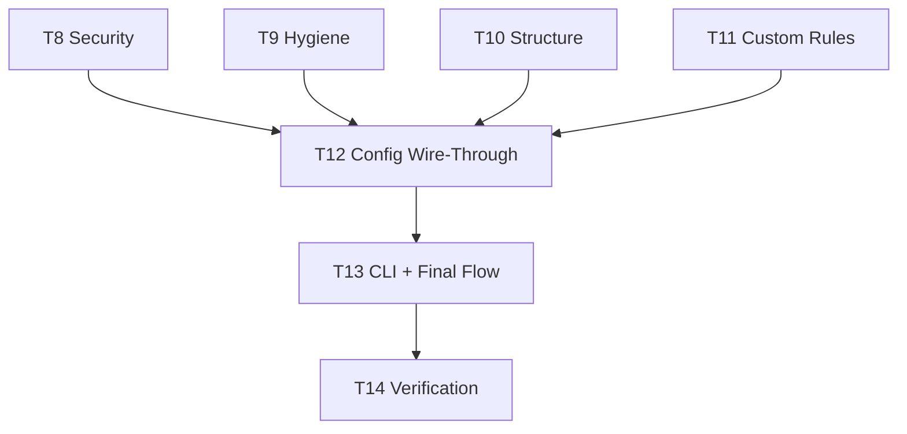
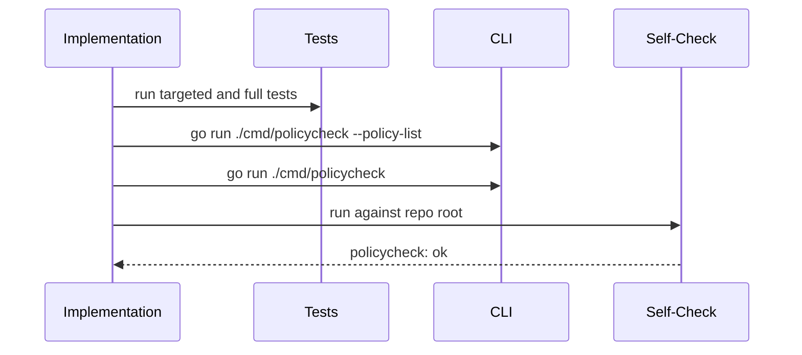
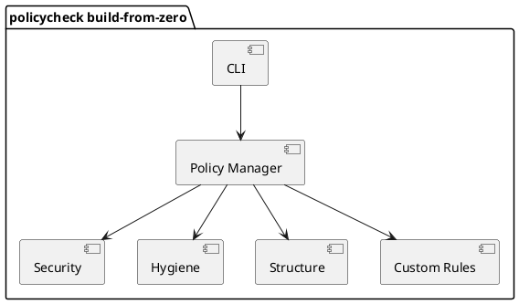
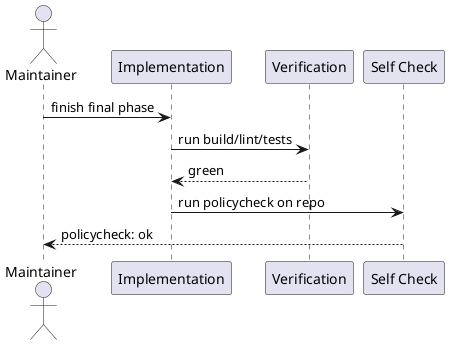

# policycheck Rewrite - Tasklist Plan B

See also `docs/policycheck/policycheck-tasklist-A.md` for the clean-room setup
and foundational phases.

---

## Overview

This plan continues the rewrite from the same assumption:

**trust the specs, not the current file tree.**

By this point, config, ports, adapters, host seam, router usage, contracts, and
quality should already be built from the spec. The remaining work continues in
that same style.

Hard rules:

- create groups from the design doc, not by splitting legacy files mechanically
- keep every new dependency crossing behind ports and the host seam
- `WRLK EXT ADD` IS NOT TO BE USED
- do not let "existing helper" reuse override the documented target behavior
- do not close the rewrite until self-check is green

---

## Plan Overview

| Task ID | Goal | Owner | Depends On | Risk |
|---|---|---|---|---|
| T8 | Build security group from the spec | AI | T5 | High |
| T9 | Build hygiene group from the spec | AI | T5 | Medium |
| T10 | Build structure group from the spec | AI | T5 | Medium |
| T11 | Build custom rules group from the spec | AI | T3, T5 | Medium |
| T12 | Wire every hardcoded behavior to config | AI | T6-T11 | High |
| T13 | Build final CLI and command flow | AI | T12 | Medium |
| T14 | Run full verification and self-check | AI/maintainer | T13 | Medium |

---

## Tasks

### T8 Build the Security Group From the Spec [ ]

Summary:
Create the secret-logging group from the documented behavior, not by inheriting
old scanning structure.

Inputs/Outputs:
- Input: design security-group sections and TDD secret cases
- Output: secret catalog and secret scan logic with thin orchestration

File changes:
- create `internal/policycheck/core/security/secret_catalog.go`
- create `internal/policycheck/core/security/secret_scan.go`
- create tests under `internal/tests/policycheck/core/security/`

Best practices and standards:
- keep ranking, allowlists, and overrides deterministic
- keep pattern data separate from orchestration
- treat scan roots and ignore prefixes as config, not constants
- keep subprocess details out of policy logic

Acceptance checks:
- secret tests cover suppression, ranking, allowlists, and overrides
- integration tests confirm scan roots and ignore prefixes
- security logic depends on host seam, not adapters

### T9 Build the Hygiene Group From the Spec [ ]

Summary:
Create symbol-name and doc-style checks as a coherent AST-based group.

Inputs/Outputs:
- Input: design hygiene sections and TDD naming/doc cases
- Output: grouped AST checks with pure predicates and thin orchestration

File changes:
- create `internal/policycheck/core/hygiene/symbol_names.go`
- create `internal/policycheck/core/hygiene/doc_style.go`
- create tests under `internal/tests/policycheck/core/hygiene/`

Best practices and standards:
- keep roots config-driven
- skip generated files consistently
- share AST helpers where behavior is identical
- do not duplicate walk logic inside both checks

Acceptance checks:
- naming and doc-style tests pass
- scan roots are controlled by config
- generated and mock files are skipped consistently

### T10 Build the Structure Group From the Spec [ ]

Summary:
Create path and package-shape checks as a separate group.

Inputs/Outputs:
- Input: design structure sections and TDD package/path cases
- Output: test-location, package-rules, and architecture checks

File changes:
- create `internal/policycheck/core/structure/test_location.go`
- create `internal/policycheck/core/structure/package_rules.go`
- create `internal/policycheck/core/structure/architecture.go`
- create tests under `internal/tests/policycheck/core/structure/`

Best practices and standards:
- count production files deterministically
- exclude `_test.go` from production counts
- parse `doc.go` concerns in pure helpers
- keep architecture enforcement config-driven

Acceptance checks:
- structure tests pass
- package concern parsing is unit-tested
- path-based orchestration remains thin

### T11 Build the Custom Rules Group From the Spec [ ]

Summary:
Create the custom-rules group as a deliberately small, regex-driven escape
hatch.

Inputs/Outputs:
- Input: design custom-rules section and TDD custom-rule cases
- Output: one config-led loop that evaluates enabled custom rules

File changes:
- create `internal/policycheck/core/custom/custom_rules.go`
- create tests under `internal/tests/policycheck/core/custom/`

Best practices and standards:
- compile patterns during config load
- respect file glob and language filtering
- keep the implementation simple and deterministic
- do not add AST or subprocess complexity to this group

Acceptance checks:
- custom rules validate at load time
- disabled, mismatched, and matching cases are covered
- custom group stays small and single-purpose

### T12 Wire Every Hardcoded Behavior to Config [ ]

Summary:
Replace every remaining hardcoded value with config-backed behavior and prove it
through override tests.

Inputs/Outputs:
- Input: TDD Phase 4 list and design config map
- Output: defaults preserve old behavior, overrides change behavior explicitly

File changes:
- update affected policy files across all groups
- create override tests in mirrored `internal/tests/policycheck/...` packages

Best practices and standards:
- write override tests before wire-through edits
- remove hidden fallback logic that bypasses config
- preserve default behavior exactly
- keep override coverage local to each policy

Acceptance checks:
- every formerly hardcoded field has an override test
- defaults still match historical behavior
- no policy silently ignores its config

### T13 Build the Final CLI and Command Flow [ ]

Summary:
Create the final command path from startup to output using the host seam and the
router-backed providers.

Inputs/Outputs:
- Input: CLI rules, router usage guide, finished host seam, finished policy groups
- Output: one startup path and one policy execution path

File changes:
- create/update `cmd/policycheck/main.go`
- create/update `internal/policycheck/cli/*`
- create/update `internal/policycheck/core/policy_manager.go`
- create/update `internal/policycheck/core/policy_registry.go`
- create/update `internal/policycheck/host/bootstrap.go`

Best practices and standards:
- boot the router once from the command entry path
- do not add hidden bootstrap logic inside policy packages
- keep CLI parsing, orchestration, and rendering separate
- preserve output format and exit behavior

Acceptance checks:
- `go run ./cmd/policycheck --policy-list` works
- `go run ./cmd/policycheck` works
- policy orchestration does not wire adapters directly

### T14 Run Full Verification and Self-Check [ ]

Summary:
Do not trust the rewrite until the tool passes the full verification set and
validates its own source tree.

Inputs/Outputs:
- Input: finished implementation
- Output: verified rewrite with `policycheck: ok`

File changes:
- docs only if implementation and docs drifted

Best practices and standards:
- run the full required verification set
- fix policy failures instead of documenting them away
- do not leave partial phases open
- treat self-check failure as a release blocker

Acceptance checks:
- `make build`
- `make lint`
- `go test ./internal/tests/... -v -count=1`
- `python scripts/scanner_test.py -v`
- `go run ./cmd/policycheck --policy-list`
- `go run ./cmd/policycheck`
- `go run ./cmd/policycheck --root . --config policy-gate.toml` returns `policycheck: ok`

---

## File Inventory

| File | Type | Classes (main methods) | Main functions (signature) | Purpose |
|---|---|---|---|---|
| `docs/policycheck/policycheck-tasklist-B.md` | new | - | - | clean-room execution checklist, second half |
| `internal/policycheck/core/security/*.go` | create | - | `CheckSecretLogging(...)`, `filterAllowlistedSecretFindings(...)` | security group |
| `internal/policycheck/core/hygiene/*.go` | create | - | `CheckSymbolNames(...)`, `CheckDocStyle(...)` | hygiene group |
| `internal/policycheck/core/structure/*.go` | create | - | `CheckTestLocation(...)`, `CheckPackageRules(...)`, `CheckArchitectureRoots(...)` | structure group |
| `internal/policycheck/core/custom/custom_rules.go` | create | - | `CheckCustomRules(root string, cfg config.PolicyConfig) []types.Violation` | custom-rules group |
| `internal/policycheck/core/policy_manager.go` | create/update | - | `RunPolicyChecks(root string, cfg config.PolicyConfig) (types.PolicyCheckResults, error)` | final orchestrator |
| `internal/policycheck/core/policy_registry.go` | create/update | `PolicyRegistration.Register()` | `BuildPolicyRegistry() []PolicyRegistration` | group registration |
| `internal/policycheck/cli/*` | create/update | formatter/error structs as needed | CLI command functions | final CLI flow |
| `cmd/policycheck/main.go` | create/update | - | `main()` | command entry |
| `internal/tests/policycheck/core/security/*` | create | test helpers | test functions | security verification |
| `internal/tests/policycheck/core/hygiene/*` | create | test helpers | test functions | hygiene verification |
| `internal/tests/policycheck/core/structure/*` | create | test helpers | test functions | structure verification |
| `internal/tests/policycheck/core/custom/*` | create | test helpers | test functions | custom-rules verification |
| `internal/tests/policycheck/**` | update | test suites | test functions | final verification |

---

## Mermaid Diagrams

### Remaining Build Order



### Closeout Sequence



---

## PlantUML Diagrams

### Component View



### Closeout Sequence



---

## Risks and Mitigations

| Risk | Why it matters | Mitigation |
|---|---|---|
| Legacy file shapes bias the rewrite | recreates the current problems | derive each group from the design doc first |
| Router wiring is edited too early | encourages unsafe fixes in infrastructure | wire router only after ports and adapters exist |
| Direct adapter imports reappear | bypasses the intended boundary | enforce router usage guide at every capability seam |
| Partial config wire-through remains | leaves hidden hardcoding behind | require explicit override tests for every field |
| Self-check fails late | costly debugging at the end | run `go run ./cmd/policycheck` throughout the work |

---

## Testing and Verification

- follow `docs/policycheck/policycheck-TDD.md`
- treat the specs as the expected behavior and current code only as a secondary comparison
- run targeted tests before advancing a task

Required closeout commands:

```powershell
make build
make lint
go test ./internal/tests/... -v -count=1
python scripts/scanner_test.py -v
go run ./cmd/policycheck --policy-list
go run ./cmd/policycheck
go run ./cmd/policycheck --root . --config policy-gate.toml
```

---

## Folder List

- `docs/policycheck/`
- `internal/policycheck/core/security/`
- `internal/policycheck/core/hygiene/`
- `internal/policycheck/core/structure/`
- `internal/policycheck/core/custom/`
- `internal/policycheck/core/`
- `internal/policycheck/cli/`
- `cmd/policycheck/`
- `internal/tests/policycheck/`
