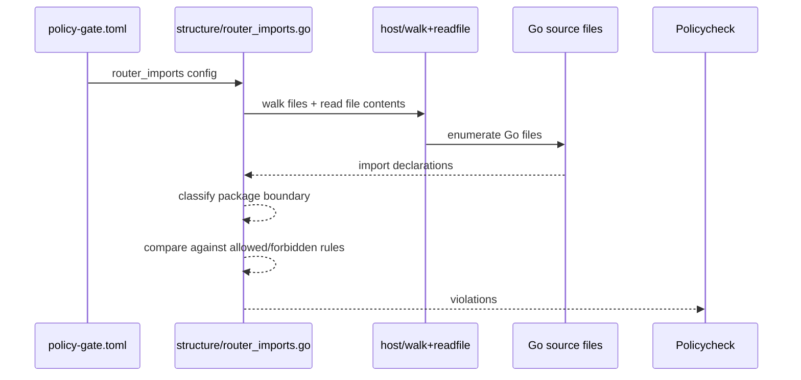

# Router Imports TDD 1

## Objective

Add a configurable policycheck rule that enforces the router import architecture described by:

- `AGENTS.md`
- `docs/router/usage.md`
- `docs/router/architecture_diagram.mmd`

The rule must detect illegal imports, missing boundary usage where direct adapter imports are used instead, and configuration drift around router package boundaries.

## Scope

- Add a new configurable structural rule for router import requirements.
- Check import relationships across business code, adapters, router core, and router boot seams.
- Keep the rule explicit and config-driven rather than relying on fragile inference.
- Add tests under `internal/tests/`.

## Non-Negotiables

- [ ] Read `AGENTS.md` before implementation.
- [ ] Read `.codex/rules/general.md` before implementation.
- [ ] Read `.codex/rules/go.md` before implementation.
- [ ] Read `docs/router/usage.md` before implementation.
- [ ] Read `docs/router/architecture_diagram.mmd` before implementation.
- [ ] Treat router contracts and documented import boundaries as authoritative.
- [ ] Do not redesign router internals while implementing the rule.
- [ ] Keep the rule configurable through `policy-gate.toml`.

## Task Checklist

- [ ] Add config types for a new `[router_imports]` policy section.
- [ ] Add defaults and validation for the new config section.
- [ ] Implement a structure-level rule under `internal/policycheck/core/structure/`.
- [ ] Detect illegal business imports of adapters and router extension packages.
- [ ] Detect illegal adapter-to-adapter imports.
- [ ] Detect illegal router-core imports of adapters or business logic.
- [ ] Allow documented boot seams to import `internal/router/ext`.
- [ ] Report actionable violations with file path, imported package, and expected boundary.
- [ ] Add the rule to the policy registry.
- [ ] Add focused tests under `internal/tests/`.
- [ ] Run focused tests and `go run ./cmd/policycheck` before finishing.

## Intended Config Shape

```toml
[router_imports]
enabled = true
business_roots = ["internal/policycheck", "internal/cliwrapper"]
adapter_roots = ["internal/adapters"]
router_core_roots = ["internal/router"]
router_boot_roots = ["internal/app", "internal/router/ext"]
allowed_business_imports = [
  "policycheck/internal/ports",
  "policycheck/internal/router",
  "policycheck/internal/router/capabilities",
]
forbidden_business_import_prefixes = [
  "policycheck/internal/adapters/",
  "policycheck/internal/router/ext/",
]
forbidden_adapter_to_adapter = true
exceptions = []
```

Note: the exact schema can be refined during implementation, but it must stay explicit and repo-tunable.

## File Plan

| File | Action | Purpose |
| --- | --- | --- |
| `internal/policycheck/config/config_manager.go` | update | Add `PolicyRouterImportsConfig` to the root config |
| `internal/policycheck/core/structure/router_imports.go` | new | Router import enforcement rule |
| `internal/policycheck/core/structure/doc.go` | update if needed | Mention the new rule if package concerns need it |
| `internal/policycheck/core/policy_registry.go` | update | Register the new rule |
| `internal/tests/policycheck/core/structure/router_imports_test.go` | new | Rule tests |
| `policy-gate.toml` | update if needed | Add default config section for local verification |

## Sequence



## TDD Cycles

### T1 Config Surface [ ]

Summary: create the config surface first so the rule is repo-tunable from day one.

RED:
- [ ] Write a failing config test for a new `[router_imports]` section.
- [ ] Write a failing config test for invalid empty root lists or malformed prefixes if validation requires it.

GREEN:
- [ ] Add `PolicyRouterImportsConfig` to `PolicyConfig`.
- [ ] Add defaults for the rule's path groups and allowed import boundaries.
- [ ] Add validation for obviously invalid config values.

REFACTOR:
- [ ] Keep config names aligned with existing policycheck terminology.
- [ ] Avoid over-generalizing into a generic dependency DSL.

Acceptance checks:
- [ ] The rule can be enabled and tuned from config.
- [ ] Config loading remains explicit and deterministic.

### T2 Business and Adapter Import Enforcement [ ]

Summary: implement the highest-value import boundary checks first.

RED:
- [ ] Write a failing test for business code importing `internal/adapters/...`.
- [ ] Write a failing test for business code importing `internal/router/ext/...`.
- [ ] Write a failing test for one adapter importing another adapter directly.

GREEN:
- [ ] Parse Go imports for candidate files.
- [ ] Flag forbidden business imports based on configured prefixes.
- [ ] Flag adapter-to-adapter imports when enabled.

REFACTOR:
- [ ] Extract small helpers for path classification and import-prefix matching.
- [ ] Keep rule messages short and actionable.

Acceptance checks:
- [ ] The most common router-boundary violations are reported clearly.

### T3 Router Core and Boot-Seam Enforcement [ ]

Summary: enforce the frozen-kernel boundary and the documented boot exception paths.

RED:
- [ ] Write a failing test for router core importing an adapter.
- [ ] Write a failing test for router core importing business logic.
- [ ] Write a failing test proving `internal/app` or other configured boot seam may import `internal/router/ext`.

GREEN:
- [ ] Detect router-core files via configured roots.
- [ ] Flag forbidden imports from router core into adapters/business packages.
- [ ] Allow documented boot-seam imports through config.

REFACTOR:
- [ ] Keep the boot exception mechanism explicit, not hardcoded in many places.

Acceptance checks:
- [ ] Router core blind spots are enforced.
- [ ] Boot seams are allowed only where documented/configured.

### T4 Violation Quality and Registry Integration [ ]

Summary: make the rule usable in real policycheck output and wire it into the normal run.

RED:
- [ ] Write a failing test for violation message quality.
- [ ] Write a failing test that the rule runs from the policy registry.

GREEN:
- [ ] Add actionable messages including file path, import, and suggested boundary.
- [ ] Register the rule in `internal/policycheck/core/policy_registry.go`.

REFACTOR:
- [ ] Normalize rule IDs and severity selection to match nearby structure rules.

Acceptance checks:
- [ ] `go run ./cmd/policycheck` includes the new rule in normal execution.

## Suggested Violation Messages

- `business package imports concrete adapter "policycheck/internal/adapters/scanners"; resolve through internal/ports + internal/router instead`
- `adapter package imports another adapter "policycheck/internal/adapters/config"; adapters must communicate through router ports`
- `router core imports business package "policycheck/internal/policycheck/host"; router core must stay blind to business logic`

## Verification

- [ ] `go test ./internal/tests/policycheck/core/structure/... -count=1`
- [ ] `go run ./cmd/policycheck --policy-list`
- [ ] `go run ./cmd/policycheck`

## Exit Criteria

- [ ] The rule is config-driven.
- [ ] Illegal router-boundary imports are detected.
- [ ] Documented boot seams are allowed.
- [ ] The rule is part of normal policycheck execution.
